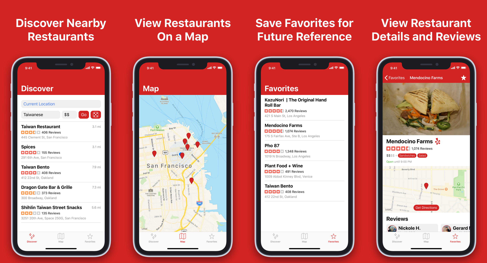

# Food Search

> Hungry but can't decide what to eat? Let us decide.

This app will help you decide what you should eat by recommending restaurants to you based on 3 given criteria. Location. Cuisine. And price.

[Download](https://testflight.apple.com/join/ovBZMF73) now on TestFlight!

## Motivation

My friends and I always seem find ourselves wondering what to eat, so I set out to create an app that could decide that for us. I know there is Yelp which is great for searching for food if you already kinda know what you want, but I couldn't find anything on the AppStore like the old UrbanSpoon app that would recommend a restaurant to you based on 3 criteria. Location, cuisine, and price.

## Screenshots

<p>
	
</p>

## Getting Started

These instructions will get you a copy of the project up and running on your local machine for development and testing purposes

This project was created using Xcode 10 and Swift 5

### Prerequisites

In order to compile this project you must have Xcode and CocoaPods installed on your Mac

* Xcode can be installed [here](https://developer.apple.com/xcode/)
* [Here](https://stackoverflow.com/questions/20755044/how-to-install-cocoapods) is a StackOverflow post on how to install CocoaPods

You will also need a Yelp account to access the Yelp Fusion API.

After creating a Yelp account navigate [here](https://www.yelp.com/developers/documentation/v3) and create an app and name it whatever you want. All you need is the API Key after it's created.

### Installing

Once you have completed the prerequisites, clone the project repo and navigate to the project directory using your terminal.

```zsh
cd path/to/project
```

After navigating to the project you will need to create a file to hold your API Key.

First, navigate to Food Search and create a folder called **Secret**
Then, inside of that folder, create a file named **Secrets.swift**
Finally, inside of **Secrets.swift**, create a public constant named **yApiKey** and set it equal to a string containing your Yelp Fusion API Key

Now, install the pods for your project by navigating back to the root project folder in your terminal and running

```zsh
pod install
```

Make sure to open **Food Search.xcworkspace**.

You should now be able to run the project.

## To Do
[Here](https://trello.com/b/A9wD8cMS) is a link to the Trello board.

## Built With

* [Yelp Fusion API](https://www.yelp.com/developers/documentation/v3/) - API used to retrieve all restaurant data
* [SDWebImage](https://github.com/SDWebImage/SDWebImage) - Library to handle downloading and caching images in iOS

## What I learned

I learned how to use the profiler to find memory leaks while debugging an application. I had to deal with a retain cycle that was caused by a strong reference to a delegate which wasn't being released when a restaurant view controller was being popped from the navigation controller

I never used User Defaults to store data before because in other projects I needed to store objects and large amounts of data and I simply didn't know how to use it. It turns out using defaults is very easy and since I didn't need to store tons of stuff, it's pretty efficient too. I implemented this using a static class.

For my networking layer, I took a protocol oriented approach so that way I could have as much flexibility as possible when creating requests. I based my approach on [this](https://matteomanferdini.com/network-requests-rest-apis-ios-swift/) article by Matteo Manferdini.

## Licensing

The code in this project is licensed under MIT license
